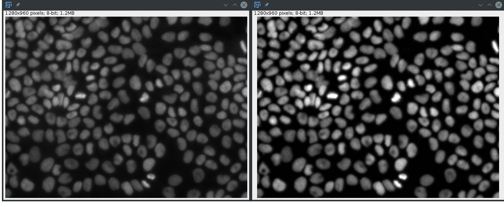
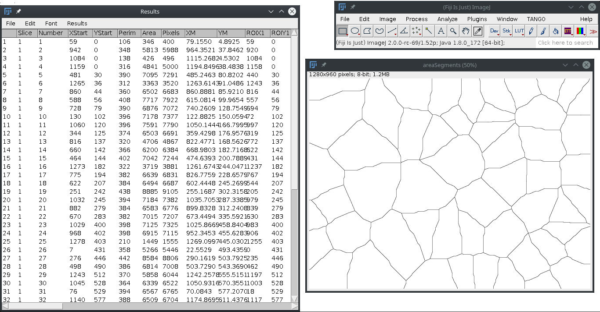
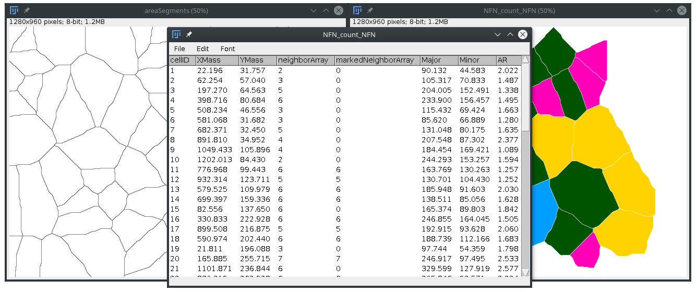
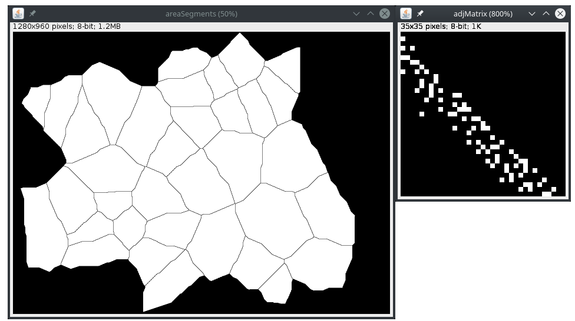
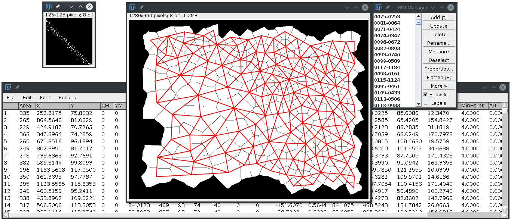

# Image Analysis Scripts and Macros for Epithelial Topology
Scripts in ImageJ's macro language for image analysis. R scripts are for data analysis and figures plots. These scripts were developed for the image analysis of the "Stochastic Model for Contact Inhibition of Proliferation" project written by [Mauro C. C. Morais](mailto:mauroccm@gmail.com) at the Mathematical Modeling Group, Institute of Cancer of the State of São Paulo (ICESP), Department of Radiology and Oncology, Faculty of Medicine, University of São Paulo ([FMUSP](http://www.fm.usp.br/fmusp/portal/)), São Paulo, Brazil. Please cite our [paper](http://www.nature.com/articles/s41598-017-07553-6) and this [code](https://doi.org/10.5281/zenodo.4672534) :)

***
## AutoCount.ijm
Script to count labeled nuclei in fluorescent images captured with the blue	filter. Images are 8-bit format. This script was designed to be executed in the Fiji headless mode by calling the code from the command line. The segmentation models are called each execution with the `computerPerformance_v2.sh` script.

USAGE:
`<Fiji folder>/ImageJ-linux64 --headless -macro <macro folder>/<macro file>.ijm`

***
## computerPerformance.sh
Scrip to evaluate the computer performance when calling `AutoCount.ijm` macro script. The script calls the Fiji macro `AutoCounter.ijm` in _headless_ mode to perform the count using the `\bin\time`. (Original script version is `AutoCellCounter_Global_v127.ijm`)

***
## Epithelial Topology Toolbox
This macro toolset contains a set of ImageJ's macro functions designed to process 8-bit images (to make it more "segmentable" for thresholding models); to estimate the cell area projection (Voronoi tesselation); and to draw epithelial topology mesh over the cells (Region connection calculus).

### Functions
#### Channel Select
This simple macro is a simple way to select the channel of interest from RGB images and convert it to 8-bit. Just click on the tool icon and select the color channel.

#### imgProcessor
This macro apply processing filter to the image. Each version adds a different processing step. The current version is v0.16. We used the increase of the signal-to-noise ratio ([SNR](https://en.wikipedia.org/wiki/Signal-to-noise_ratio)) between the raw and processed images as selection criterion for processing steps.

#### Count Cells
This script counts the number of cells (particles) in the image. It opens the preprocessed 8-bit image, binarize with minimum cross-entropy thresholding model (Li's model) and count the number of particles.

#### cellPosition2areaSegment
This macro get the nuclei postions (center of mass from the Results table) and build the Voronoi diagram (the cell area projection).

#### NFN_count
This macro get the cell area projections and count the number of nearest neigbor of each cell. Cells in the edge of the image are counted as first neighbors, but excluded in the image (See the markedNeighborArray). Other shape descriptors are also obtained to measure anisotropy of each cell area projection. This function was dadpted from [Neighbor Analysis](https://imagej.net/BioVoxxel_Toolbox#Neighbor_Analysis) of the Biovoxxel Toolbox.

	
#### adjMatrix
This macro get the cell area projections and calculates the RCC table. The RCC table is the adjacency table of each cell and it depends on the RCC8D plugin 
(https://blog.bham.ac.uk/intellimic/spatial-reasoning-with-imagej-using-the-region-connection-calculus/).

#### adjMatrix2mesh
This macro draws the edges of the cell network over the area segment image. Open the adjacency matrix file, generated with the `adjMatrix` macro, rename it to `adjMatrix`, and open the cell area projection before runnig the script.

#### getCellLayers
This macro returns the image of each cell layer from the melanoma cluster.

It requires the BinaryReconstruct function form the [Morphology](https://beardatashare.bham.ac.uk/getlink/fiLUS55SmtWwJKijDRbwqv9p/morphology.zip) plugin. It also depends of the 'glasbey_on_dark.lut' available on Fiji.
 
Special thanks to G. Landini, Univ. of Birmingham, for sharing the code.
Landini and Othman, 2003, J. of Microscopy, 
DOI: 10.1046/j.1365-2818.2003.01113.x

#### getBorder
This scripts returns the line between keratinocytes and melanoma cluster. The input image must be binary and cell cross-section area (Voronoi) of the keratinocytes surrounding the melanoma domain.

Special thanks to G. Landini, Univ. of Birmingham;
Landini and Othman, 2003, J. of Microscopy, 
DOI: 10.1046/j.1365-2818.2003.01113.x

#### jaccardIndex
This macro calculate the Jaccard Index ([JI](https://en.wikipedia.org/wiki/Jaccard_index)) between two images binary images and retunrs the value in the log window.

***
### Instalation
1. Unzip the [ETT.zip](./ETT.zip) file in your `Fiji.app/macros/` directory. This should create a new `./ETT/` folder in your macros directory.
2. Start Fiji.
3. Go to _Plugins > Macros > Install..._ and select the `ETT/ETT.ijm` file in your `macros` folder.

***
### License
These macro codes are free software; you can redistribute it and/or modify it under the terms of the GNU General Public License as published by the Free Software Foundation (GNU General Public License v3.0). It is distributed in the hope that it will be useful, but WITHOUT ANY WARRANTY and LIABILITY; without even the implied warranty of fitness for a particular purpose. See the [GNU General Public License](./LICENSE) for more details. 
